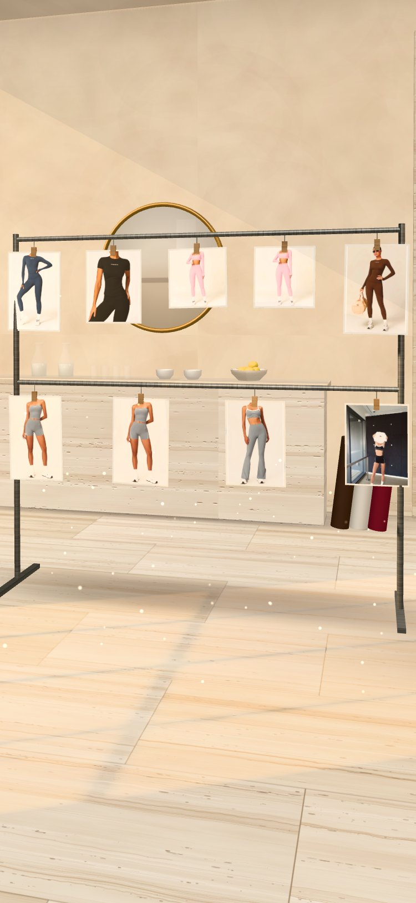

# The Increments Lounge

A one-off, walk-in digital shop for [Increments](https://increments.ca): a travertine café-lounge you move through station by station, where the current chapter is on the menu and everything on display can be ordered. It supplements the Shopify store — the tray hands off to the real Increments checkout.


| The Window — *Still Becoming* | The Counter — the menu | The Lounge — *Worn* |
|---|---|---|
|  |  |  |
| **Movement Bar** | **The Archive** | **Notice Board** |
|  |  |  |

On a phone, every station has its own portrait framing:

| | | | | |
|---|---|---|---|---|
|  |  |  |  |  |

---

## The idea

Increments' colourways already read like a café menu — Cloudstone, Chestnut, Charcoal, Espresso, Cherry — and the brand speaks in chapters ("The First Chapter", "Still Becoming", "One chapter. Yours."). So the Lounge is a place to pause between steps:

| Station | What's there | What it does for the shop |
|---|---|---|
| **01 Step inside** | Establishing view, wayfinding labels | Orientation; the stamp card starts |
| **02 The Window** | *Still Becoming* in Scarlet, Evergreen and Midnight, standing as ghost-mannequin outfits on travertine plinths in the morning sun | The new drop |
| **03 The Counter** | Fluted travertine bar, espresso machine, a menu board painted from the live catalog, socks & caps in the glass case "at the till" | The whole range, and easy add-ons |
| **04 The Lounge** | Burgundy leather banquette, travertine tables, *Worn* hung on walnut hangers | Loungewear |
| **05 Movement Bar** | Steel rack of pegged prints by a water & matcha bar | Activewear |
| **06 The Archive** | Past chapters as books on a walnut shelf — one spine per sold-out piece | Brand story; the last few pieces still in stock |
| **07 Notice Board** | Team quotes, Polaroids, and "Your next increment" | Community + shareable UGC |

Three mechanics tie it to the name:

- **The stamp card** — eight increments (visit stations, order something, pin your increment). Optional reward code applied at checkout when full.
- **Your next increment** — visitors write the next small step they're taking; it's pinned to the board in the room and rendered as a 1080×1920 story card to share or save. Made on-device, nothing uploaded.
- **The tray** — a café receipt. "Pay at the counter" drops the shopper into the Increments checkout with the tray already in the cart.

## How it's built

- **Static site, no build step.** Plain ES modules + [three.js r170](https://threejs.org) from jsDelivr via an import map. Host anywhere static; GitHub Pages is set up.
- **Everything is procedural.** Travertine (vein-cut, with honey bands and pits), walnut, leather, bouclé, plaster, cork — all generated on the visitor's device in canvas (`assets/js/scene/stone.js`), ~25 ms for a 2K floor. No 3D model or texture downloads; total transfer is roughly three.js + fonts + product photos.
- **Real products, real stock.** `data/catalog.json` is a snapshot of the Shopify store (`/products.json`), refreshed hourly by a GitHub Action. Every variant's availability drives the size/colour pickers.
- **Photos become objects.** Flat product shots on plain backgrounds are cut out in the browser (`scene/cutout.js`: edge flood-fill, colour-decontaminated edges) and stood up in the room. On-model photos are framed or pegged instead. If a colourway has no clean shot, it's found among the product's other images by matching the garment's average colour to the swatch.
- **Checkout via Shopify cart permalinks** — `https://increments.ca/cart/<variant>:<qty>,…` with UTM tags, `ref`, and a `Found in: The Increments Lounge` cart attribute on every order. No API token, no backend. Verified against the live store.
- **Light**: one shadow-casting sun through real arched openings (so the patches on the floor are arch-shaped), hemisphere + fill, a few warm point lights, baked-feeling contact shadows, fake volumetric shafts with dust, steam from the cups. Neutral tone mapping keeps garment colours true.

```
index.html                 page shell (HUD, dock, intro, dialog layer)
assets/css/lounge.css      design system: travertine / espresso / paper; Bodoni Moda, Hanken Grotesk, Azeret Mono, Caveat
assets/js/
  main.js                  boot, navigation, input, picking, wiring
  config.js                ← store, attribution, dates, reward, analytics
  catalog.js  cart.js  stamps.js  audio.js  analytics.js
  scene/
    world.js               renderer, quality tiers, frame loop, adaptive resolution
    stone.js  materials.js procedural surfaces → three.js materials (world-scale UVs)
    layout.js              the floor plan (metres)
    room.js                shell, arched window wall, street outside, lights
    furniture.js           counter, backbar, plinths, rack, banquette, shelf, board, plants…
    displays.js            puts the catalog into the room; hotspots
    fx.js                  light shafts, dust, steam (GPU-animated)
    stations.js            the seven stations + camera rig (landscape & portrait framing)
    cutout.js              product photo → cut-out or print
  ui/                      hud, hotspots, dialogs, product sheet, tray, menu, stamp card, archive, composer
data/catalog.json          store snapshot (generated)
data/merch.json            ← merchandising rules: which products go where, swatch colours
tools/                     refresh_catalog.py, serve.py, contact-sheet.html (cut-out QA), stone-lab.html, scene-test.html
```

## Run it locally

```bash
python3 tools/serve.py
```

Then open <http://localhost:8420>. (`serve.py` is `http.server` with caching turned off so module edits show on reload.)

Useful URL flags: `?quality=low|mid|high` forces a tier, `?debug` logs analytics events to the console, `#counter` (or any station id) deep-links to a station.

## Change what's in the room

| To… | Edit |
|---|---|
| Refresh products/prices/stock now | `python3 tools/refresh_catalog.py` (the Action does this hourly) |
| Move products between stations, hide one, add a swatch colour | `data/merch.json`, then refresh |
| Set opening/closing dates for the one-off run | `opensOn` / `closesOn` in `assets/js/config.js` (outside the window, visitors get a friendly "closed" card pointing to the store) |
| Give the full stamp card a reward | Create a discount in Shopify, put the code in `reward.code` |
| Rename the campaign in UTMs | `attribution` in `config.js` |
| Station copy and camera framing | `assets/js/scene/stations.js` |
| Check how every product photo will cut out | open `/tools/contact-sheet.html` locally |

The window display looks for a hoodie + sweat pair in the `window` zone; the lounge rail for the same in `lounge`. Movement prints and the till case take whatever is in their zones. The archive groups by `chapters` in `merch.json`.

## Deploy (GitHub Pages)

1. Create a repository (public, or private on a paid plan), and push this folder to `main`.
2. **Settings → Pages → Build and deployment → Source: GitHub Actions.**
3. The *Deploy to GitHub Pages* workflow publishes on every push. It ships only `index.html`, `404.html`, `robots.txt`, `assets/` and `data/` — tools and docs stay out.
4. *Refresh catalog* runs hourly (and on demand from the Actions tab) and redeploys when anything changed.

**Custom domain (recommended: `lounge.increments.ca`)** — add a `CNAME` file containing the domain, set it under Settings → Pages, and add a DNS `CNAME` record for `lounge` pointing to `<your-github-username>.github.io`. Then tick *Enforce HTTPS*.

**Link from the store** — add a homepage banner/announcement ("Step into the Lounge →") in Shopify. The Lounge links back to the store in the header and after every product.

## Accessibility & mobile

- Everything in the room is reachable without the canvas: hotspots are real `<button>`s pinned to 3D positions; "Skip the lounge — shop the menu" is the first focusable element; the Menu is a complete, accessible list of the range.
- Native `<dialog>` for every panel (focus trap, Esc, inert background). Radio-group semantics and arrow keys for colour/size. Station changes are announced via a live region.
- Keyboard: ←/→ between stations, 1–7 to jump, M for the menu.
- `prefers-reduced-motion`: camera cuts instead of glides, no drift/parallax, no ripples.
- Phones: portrait-specific camera framing per station, the view's centre is lifted above the caption/dock, swipe to move, bottom sheets with drag-to-close, 44 px targets, safe-area insets.
- No WebGL (or it fails): the intro offers the Menu, which is the whole shop.

## Performance

- Quality tiers (`low`/`mid`/`high`) from device signals + Save-Data; textures 1K on phones, 2K on desktop.
- Adaptive resolution: if frames run long for ~2 s the render resolution steps down (and back up when there's headroom).
- The shadow map is only re-rendered while pieces are arriving (the sun doesn't move).
- Rendering pauses behind the full-screen menu and in background tabs; audio suspends too.
- Product images are requested at the size they're shown via Shopify's CDN `width=` parameter.

## Analytics

Every interaction is pushed to `window.dataLayer` as `lounge_<event>` (ready for GTM/GA4/Meta). Set `analytics.ga4` in `config.js` to load GA4 directly. Events: `open`, `enter`, `station_view`, `product_open`, `colour_select`, `size_select`, `add_to_tray`, `tray_open`, `checkout_click`, `menu_open`, `stamp_earned`, `card_complete`, `archive_open`, `increment_created`, `increment_shared`, `sound_toggle`, `newsletter_click`, `quality_change`, `webgl_unavailable`, `closed_view`, `boot_error`.

In Shopify, Lounge orders carry the cart attribute **Found in: The Increments Lounge** and arrive with `utm_source=increments-lounge`.

See [docs/LAUNCH.md](docs/LAUNCH.md) for the launch plan, QA checklist and what to measure.

## Credits

Built for Increments. Product photography and copy © Increments. three.js (MIT). Fonts from Google Fonts (OFL).
