# The Increments Lounge

A one-off, walk-in digital boutique for [Increments](https://increments.ca): you arrive on the street outside an arched storefront, step through the doors into a sculpted travertine lounge-café, and move through it station by station. The new chapter is on display, everything you see can be ordered, and there's a board where visitors leave the next small step they're taking. It supplements the Shopify store — your bag hands off to the real Increments checkout.

**Live:** <https://incrementsshop.github.io/increments-lounge/>

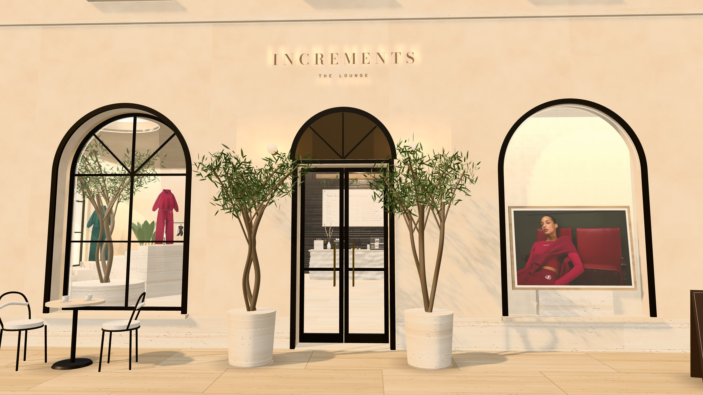

| Golden hour | Evening |
|---|---|
| 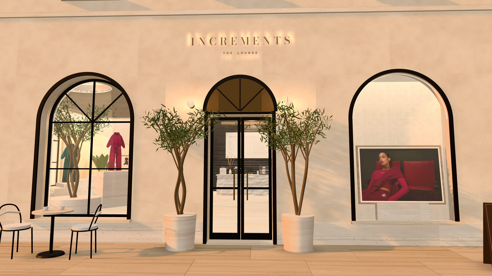 | 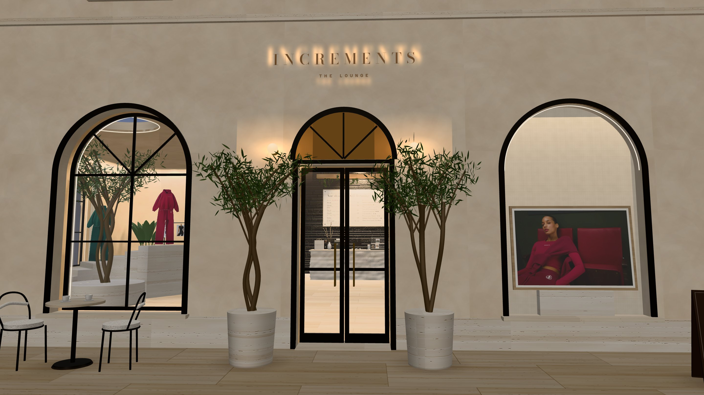 |

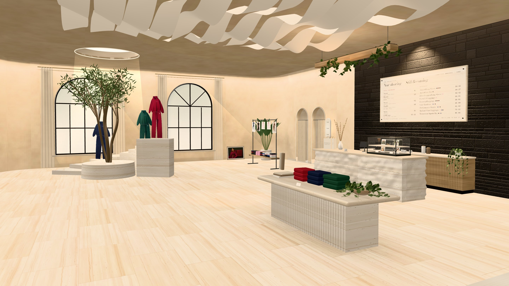

| The Steps — *Still Becoming* | The Collection | The Lounge — *Worn* |
|---|---|---|
| 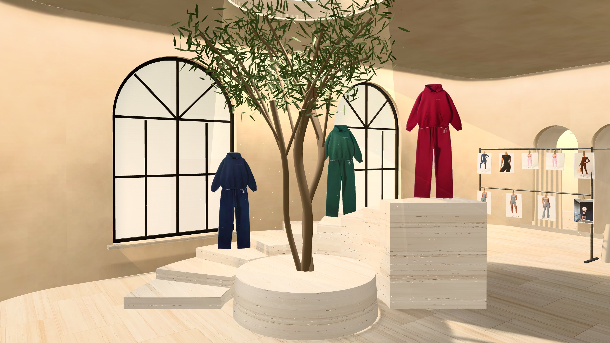 | 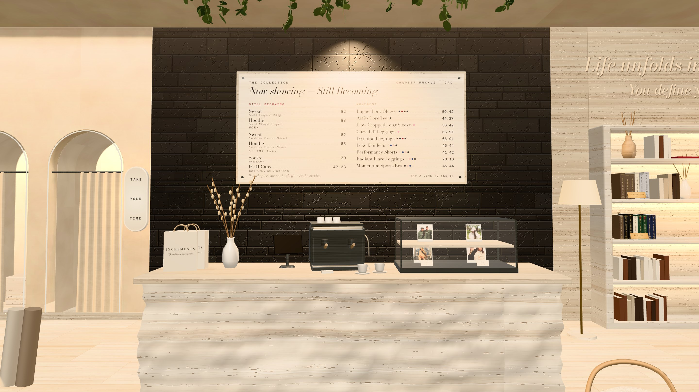 | 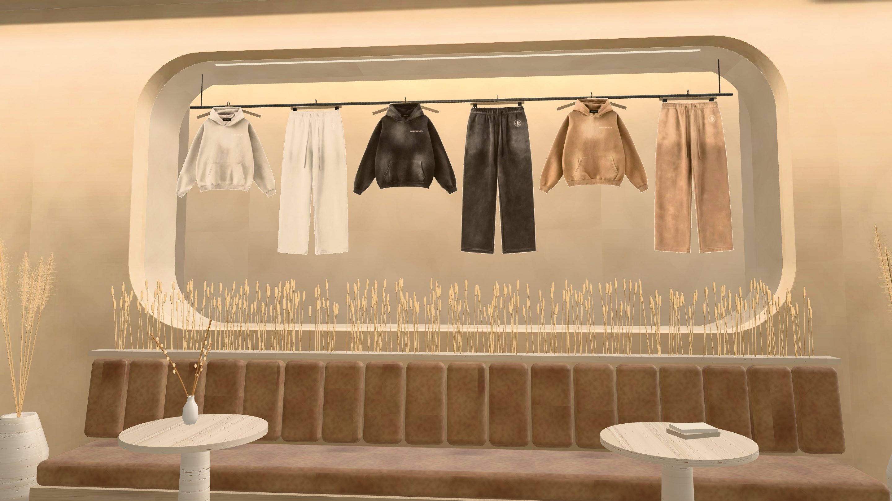 |
| **Movement** | **The Archive** | **Notice Board** |
| 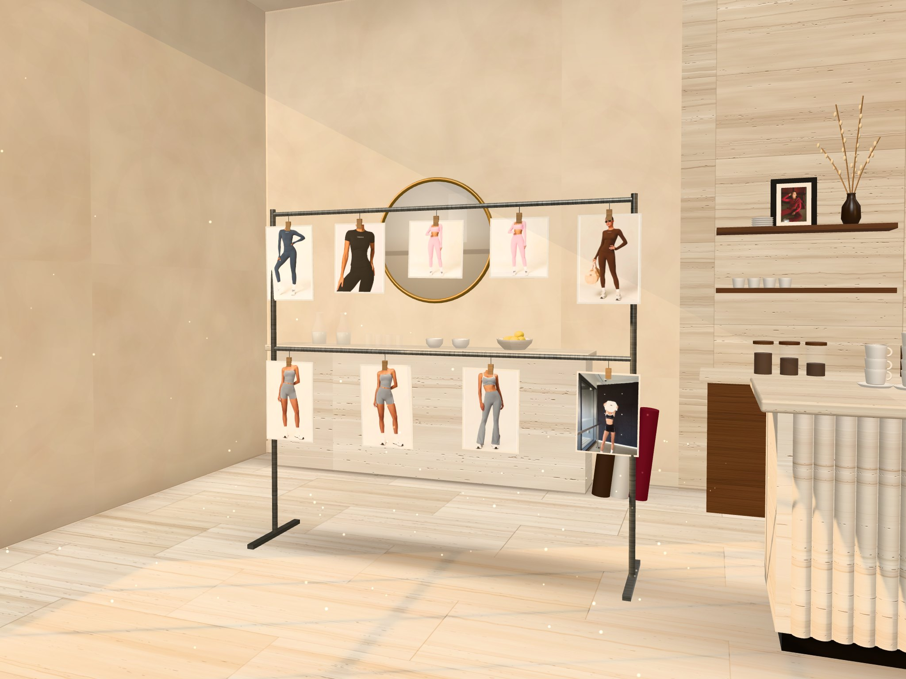 | 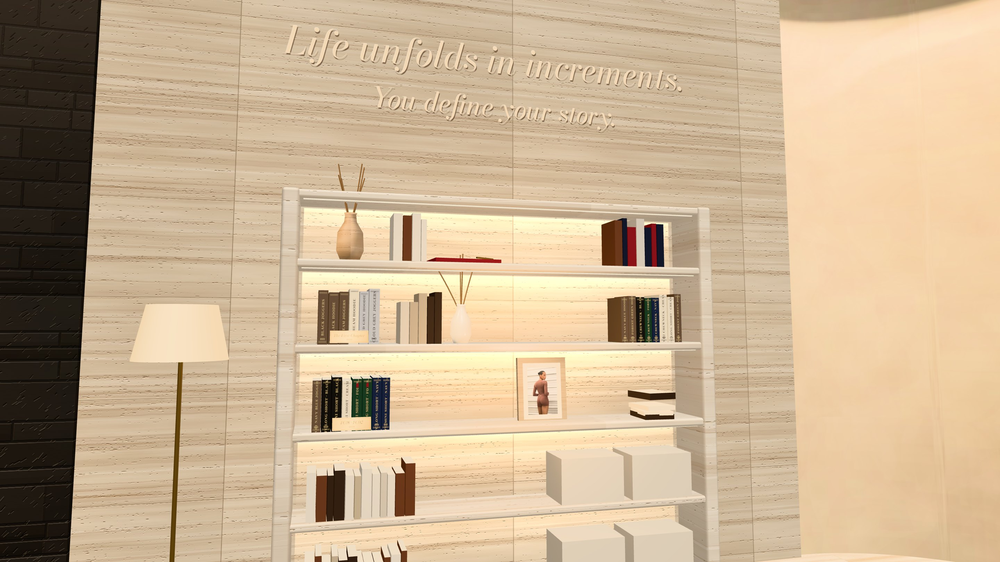 | 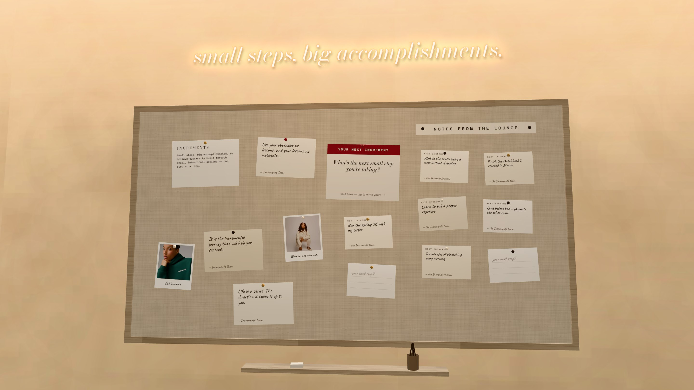 |

The room follows the visitor's clock — morning, golden hour, evening — with light that's pre-calculated for each:

| Morning | Golden hour | Evening |
|---|---|---|
|  | 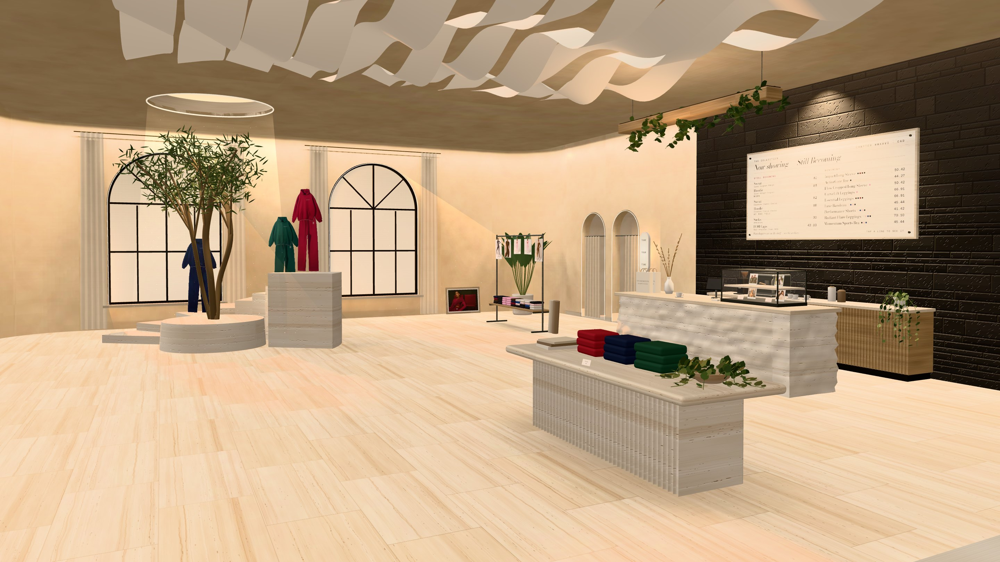 | 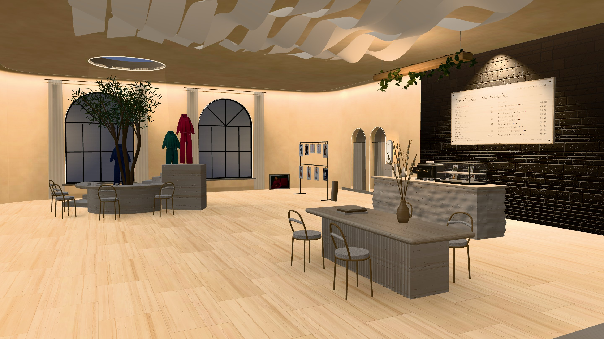 |

On a phone, every station has its own portrait framing (the board is shown with `?boardDemo` sample notes):

| | | | | | | |
|---|---|---|---|---|---|---|
| 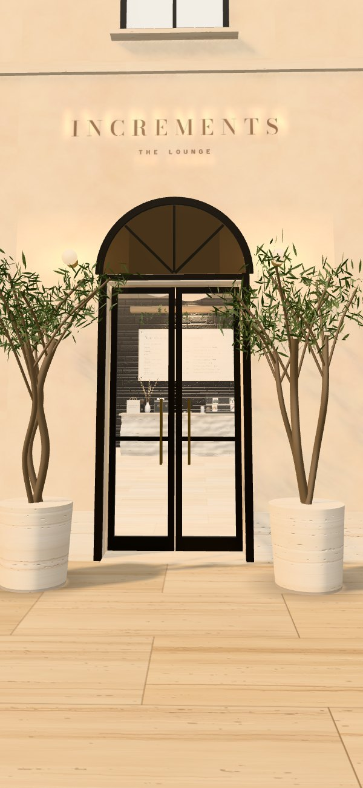 | 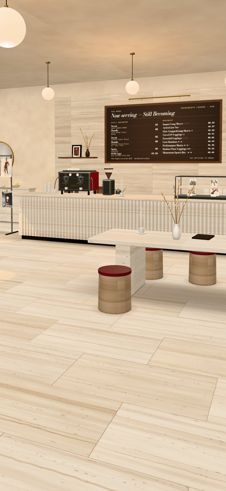 | 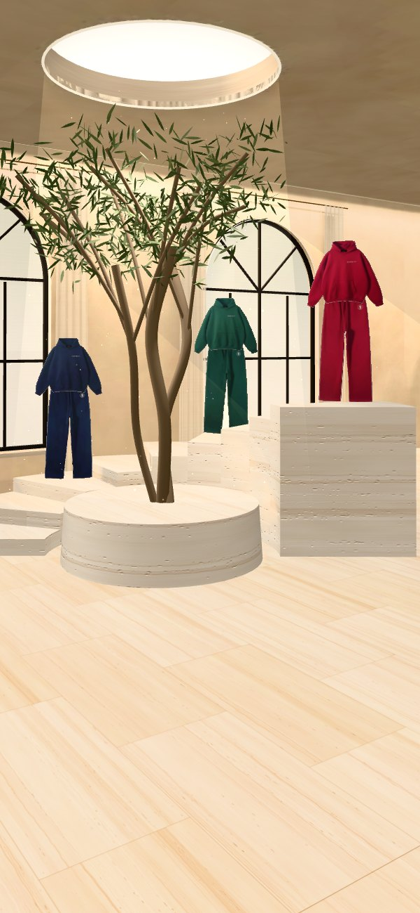 | 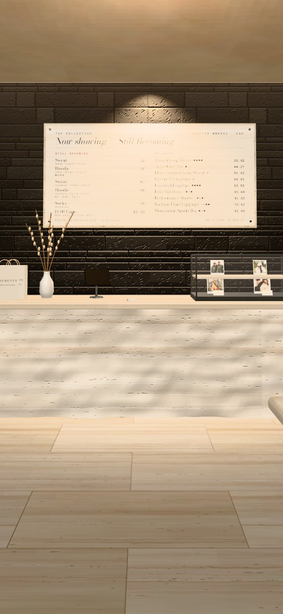 | 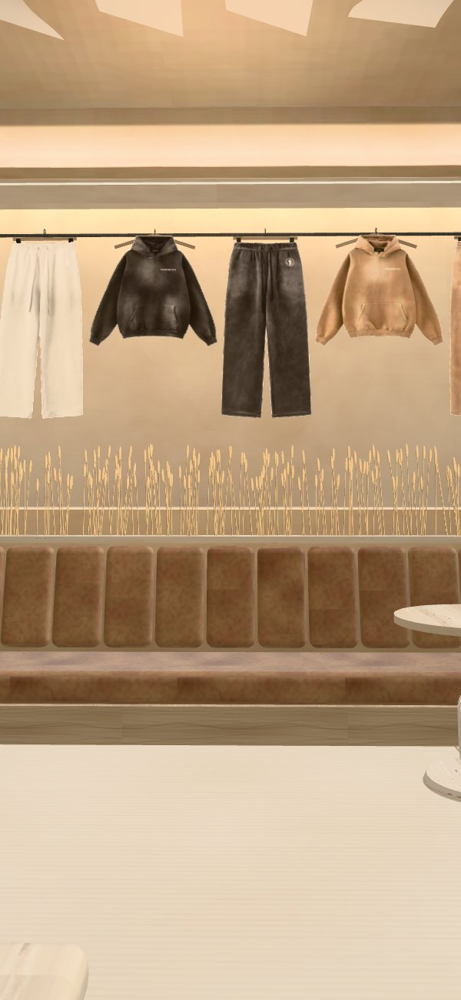 | 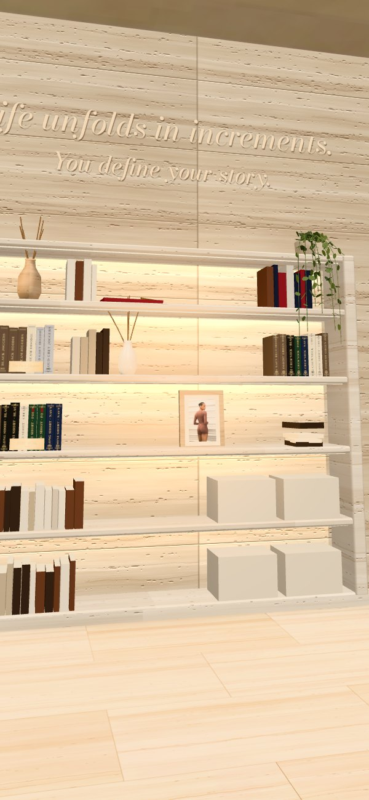 | 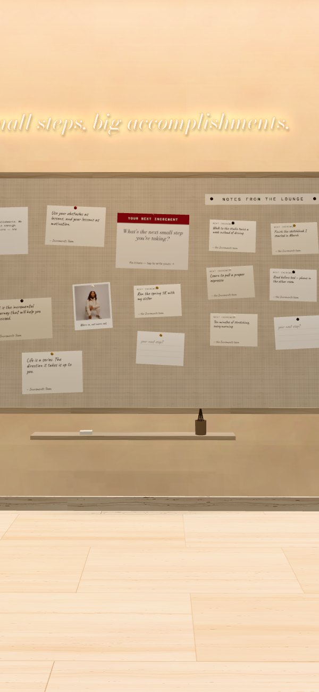 |

---

## The idea

The brand speaks in steps and chapters: "Small steps, big accomplishments", "The First Chapter", "Still Becoming". The client's boards are tone-on-tone limestone and plaster, curved and carved rooms, hidden light, raw stone, stairs, a tree under a skylight, words on the walls — and, from her café board, arched shopfronts, fabric ceilings, olives you sit around, fluted counters, greenery and neon. So the Lounge is one warm, quiet material — travertine, plaster, oak, black steel — with scarlet as the only colour, and green left to the plants:

| Station | What's there | What it does for the shop |
|---|---|---|
| **The street** | A limewashed facade: black steel arched doors, a shop window onto the Steps, the campaign lit in an arched vitrine, INCREMENTS in halo-lit letters, olives, a café table, an A-frame | First impression; the doors swing open as you step in |
| **01 Step inside** | The whole room: fabric waves under the floating ceiling, glowing cove, curved corners, soft light from the ceiling over the middle of the room | Orientation; the stamp card starts |
| **02 The Steps** | *Still Becoming* in Midnight, Evergreen and Scarlet, rising on nine curved travertine steps around an olive under a round skylight | The new drop |
| **03 The Collection** | A rough-hewn travertine counter before a black split-stone wall, greenery trailing from a hung planter; behind it a fluted oak espresso bar with the machine, grinder and cups; every piece and price carved into a travertine plaque; socks & caps in the glass case "at the till"; a fluted travertine island set with lookbooks and a bowl of trailing greens | The whole range, and easy add-ons |
| **04 The Lounge** | Sand leather banquette with pampas at either end, travertine tables, bouclé chairs; *Worn* hung inside a lit rounded niche | Loungewear |
| **05 Movement** | Steel rack of pegged prints in front of two arched fitting rooms outlined in light, a pill lightbox: *Take your time* | Activewear |
| **06 The Archive** | Travertine shelves lit from within, one book spine per past piece; *Life unfolds in increments. You define your story.* raised on the stone above | Brand story; the last few pieces still in stock |
| **07 Notice Board** | Under *small steps, big accomplishments.* in warm neon: team quotes, Polaroids, "Your next increment", and *Notes from the Lounge* — other visitors' next steps, approved by the team | Community + shareable UGC |

Three mechanics tie it to the name:

- **The stamp card** — eight increments (visit stations, order something, pin your increment). Optional reward code applied at checkout when full.
- **Your next increment** — visitors write the next small step they're taking; it's pinned to the board in the room and rendered as a 1080×1920 story card to share or save, made on-device. Optionally it goes up on the **shared board** for everyone, once the team has read it ([docs/BOARD.md](docs/BOARD.md)).
- **The bag** — a boutique receipt. "Pay at the counter" drops the shopper into the Increments checkout with everything already in the cart.

## Moving through the room

A guided visit, not a video game: one open room, 18 × 12 m under a 4.4 m ceiling, and seven framed stations you glide between, with room to linger.

- **Arrive.** Every visit (except deep links) starts on the street. "Step inside" swings the doors open and walks you in, one continuous move; any key or tap mid-walk hands control back.
- **Stations.** Arrows in the dock, swipe, the station list, ←/→ or 1–7. Every move is a slow, composed camera glide.
- **Look around.** Drag anywhere to turn your head — about 38° each way, and a little up and down. Let go and the view drifts back to the composed shot. Keep pulling past the edge and you walk on to the next station.
- **Lean in.** Tap a piece in the room (or its label) and you step up to it; its details open beside it — to the side on a computer, below it on a phone, where the sheet is shorter so the piece stays in view. Close the details and you step back.
- **Take the walk.** From the entrance, a slow guided loop through all seven stations, lingering and easing in at each. Any touch, key or scroll hands control back.
- **Atmosphere** (the sun/moon in the top bar). Time of day — follows the visitor's clock unless they pick one — and the room's sound.

## How it's built

- **Static site, no build step.** Plain ES modules + [three.js r170](https://threejs.org) from jsDelivr via an import map. Host anywhere static; GitHub Pages is set up.
- **Everything is procedural.** Travertine (vein-cut and rough-cut), black split-face stone, limewashed oak, sand and scarlet leather, bouclé, linen, plaster — all generated on the visitor's device in canvas (`assets/js/scene/stone.js`), ~25 ms for a 2K floor. The rough-hewn counter and island are chiselled by displacing geometry with noise. No 3D model or texture downloads; total transfer is roughly three.js + fonts + product photos.
- **Real products, real stock.** `data/catalog.json` is a snapshot of the Shopify store (`/products.json`), refreshed by a GitHub Action scheduled hourly (GitHub runs it every few hours in practice; it retries if Shopify is busy). Every variant's availability drives the size/colour pickers, a saved bag is re-checked against it on each visit, and Shopify's checkout has the final say on stock.
- **Photos become objects.** Flat product shots on plain backgrounds are cut out in the browser (`scene/cutout.js`: edge flood-fill, colour-decontaminated edges) and stood up in the room. On-model photos are framed or pegged instead. If a colourway has no clean shot, it's found among the product's other images by matching the garment's average colour to the swatch.
- **Checkout via Shopify cart permalinks** — `https://increments.ca/cart/<variant>:<qty>,…` with UTM tags, `ref`, and a `Found in: The Increments Lounge` cart attribute on every order. No API token, no backend. Verified against the live store.
- **Light you don't see the source of**: a floating ceiling whose cove washes every wall, lit niches and shelves, a grazing light down the black stone, a round skylight pouring onto the olive, and the sun through real arched openings (so its patches on the floor are arch-shaped). Fake volumetric shafts with dust, neutral tone mapping so garment colours stay true.
- **Pre-calculated lighting.** The room's shell (floor, walls, corners, ceiling) wears lightmaps baked in the browser by `tools/bake.html`: hundreds of passes with a soft sun, sky light through the windows and skylight, the cove LEDs, the lamps and one bounce off the floor, with every piece of furniture casting soft shadows. One set per time of day, ~85 KB each. The shell then needs no live lights at all — richer light for less work on a phone — while garments and furniture stay lit live so they can sway. Stone keeps its real reflections, shaded by the bake so corners and the floor under the island stay grounded.
- **Time of day.** `scene/lighting.js` fades every light, the street outside, the skylight, the dust and the lightmap set between morning, golden hour and evening — and every sign, sconce, LED line and lit window (`glows`), which barely show at noon and bloom at night.
- **Words in light** (`scene/signs.js`): neon script drawn with its own falloff plus a padded additive bloom, a pill lightbox, halo-lit letters, LED lines that trace arches. No post-processing needed.

```
index.html                 page shell (HUD, dock, intro, dialog layer)
assets/css/lounge.css      design system: travertine / espresso / paper / one scarlet; Bodoni Moda, Hanken Grotesk, Azeret Mono, Caveat
assets/js/
  main.js                  boot, navigation, input, picking, wiring
  config.js                ← store, attribution, dates, reward, analytics
  catalog.js  cart.js  stamps.js  audio.js  analytics.js
  scene/
    world.js               renderer, quality tiers, frame loop, adaptive resolution
    stone.js  materials.js procedural surfaces → three.js materials (world-scale UVs)
    layout.js              the floor plan (metres)
    room.js                shell: walls with arched windows, fitting-room alcoves and the lounge niche; curved corners; floating ceiling + cove; skylight; daylight
    furniture.js           the Steps + olive, black wall + plaque, rough counter + espresso bar, plants, fitting rooms, rack, banquette, archive + brand line, island, board…
    displays.js            puts the catalog into the room; hotspots
    fx.js                  window shafts, skylight column, dust (GPU-animated)
    stations.js            the seven stations + camera rig (framing, glides, look-around, lean-in)
    storefront.js          the facade, doors, shop window, vitrine, sign, olives, café table, A-frame, pavement
    signs.js               words in light: neon, pill lightbox, halo letters, LED lines
    pieces.js              shared pieces: olive, fig, bird of paradise, trailing pothos, bistro chair (terrace), cups, espresso machine, grinder, pampas
    lighting.js            time of day: presets, the street outside, glows, fades
    lightmaps.js           baked light for the shell (shared with the baker so UVs always match)
    cutout.js              product photo → cut-out or print
  board.js                 the shared notice board (Supabase, pre-moderated)
  ui/                      hud, hotspots, dialogs, product sheet, bag, collection list, stamp card, archive, composer, atmosphere, board panel
assets/lightmaps/          baked light: <time>/<surface>.webp + manifest.json (generated)
data/catalog.json          store snapshot (generated)
data/merch.json            ← merchandising rules: which products go where, swatch colours
tools/                     refresh_catalog.py, serve.py, bake.html + baker.js (lightmaps), contact-sheet.html (cut-out QA), stone-lab.html, scene-test.html
docs/                      LAUNCH.md, BOARD.md + board-setup.sql, shots/
```

## Run it locally

```bash
python3 tools/serve.py
```

Then open <http://localhost:8420>. (`serve.py` is `http.server` with caching turned off so module edits show on reload.)

Useful URL flags: `?quality=low|mid|high` forces a tier, `?time=morning|golden|evening` forces the time of day, `?boardDemo` fills the notice board with labelled sample notes, `?debug` logs analytics events to the console, `#counter` (or any station id) deep-links to a station.

## Change what's in the room

| To… | Edit |
|---|---|
| Refresh products/prices/stock now | `python3 tools/refresh_catalog.py` (the Action does this hourly) |
| Move products between stations, hide one, add a swatch colour | `data/merch.json`, then refresh |
| Set opening/closing dates for the one-off run | `opensOn` / `closesOn` in `assets/js/config.js` (outside the window, visitors get a friendly "closed" card pointing to the store) |
| Give the full stamp card a reward | Create a discount in Shopify, put the code in `reward.code` |
| Rename the campaign in UTMs | `attribution` in `config.js` |
| Station copy and camera framing | `assets/js/scene/stations.js` |
| Move a piece or resize the room | `assets/js/scene/layout.js` (each station's shot is set relative to its piece, so it follows), then re-bake |
| Check how every product photo will cut out | open `/tools/contact-sheet.html` locally |
| Re-bake the lighting (after moving walls or furniture, or tuning a time of day in `scene/lighting.js → TIMES.*.bake`) | run `serve.py`, open `/tools/bake.html`, press **Bake** (~40 s), commit `assets/lightmaps/` |
| Switch on the shared notice board | [docs/BOARD.md](docs/BOARD.md) — a free Supabase project and two values in `config.js` |

The Steps look for a hoodie + sweat pair in the `window` zone (three colourways, one per step); the lounge niche for the same in `lounge`. The campaign photo is `featured.campaignImage` in `merch.json`. Movement prints and the till case take whatever is in their zones. The archive groups by `chapters` in `merch.json`.

## Deploy (GitHub Pages)

1. Create a repository (public, or private on a paid plan), and push this folder to `main`.
2. **Settings → Pages → Build and deployment → Source: GitHub Actions.**
3. The *Deploy to GitHub Pages* workflow publishes on every push. It ships only `index.html`, `404.html`, `robots.txt`, `assets/` and `data/` — tools and docs stay out.
4. *Refresh catalog* runs hourly (and on demand from the Actions tab) and redeploys when anything changed.

**Custom domain (recommended: `lounge.increments.ca`)** — add a `CNAME` file containing the domain, set it under Settings → Pages, and add a DNS `CNAME` record for `lounge` pointing to `<your-github-username>.github.io`. Then tick *Enforce HTTPS*.

**Link from the store** — add a homepage banner/announcement ("Step into the Lounge →") in Shopify. The Lounge links back to the store in the header and after every product.

## Accessibility & mobile

- Everything in the room is reachable without the canvas: hotspots are real `<button>`s pinned to 3D positions; "Skip the lounge — shop the collection" is the first focusable element; the Collection (the Shop button) is a complete, accessible list of the range.
- Native `<dialog>` for every panel (focus trap, Esc, inert background). Radio-group semantics and arrow keys for colour/size. Station changes are announced via a live region.
- Keyboard: ←/→ between stations, 1–7 to jump, M for the collection list. Look-around is a pointer extra; nothing depends on it.
- `prefers-reduced-motion`: camera cuts instead of glides (including the walk-in from the street, lean-in and the walk), no drift/parallax, no push-in, no ripples, and time-of-day changes are instant.
- The walk announces itself to screen readers and stops on any key.
- Phones: portrait-specific camera framing per station, the view's centre is lifted above the caption/dock, drag to look / pull or swipe to move, bottom sheets with drag-to-close, 44 px targets, safe-area insets.
- No WebGL (or it fails): the intro offers the Collection, which is the whole shop.

## Performance

- Quality tiers (`low`/`mid`/`high`) from device signals + Save-Data; textures 1K on phones, 2K on desktop.
- Adaptive resolution: if frames run long for ~2 s the render resolution steps down (and back up when there's headroom).
- The shadow map is only re-rendered while pieces are arriving or the time of day changes.
- The shell's light is baked (≈250 KB for all three times), so floor, walls and ceiling cost one texture lookup instead of every light in the room.
- Rendering pauses behind the full-screen collection list and in background tabs; audio suspends too.
- Product images are requested at the size they're shown via Shopify's CDN `width=` parameter.

## Analytics

Every interaction is pushed to `window.dataLayer` as `lounge_<event>` (ready for GTM/GA4/Meta) and sent through the store's own Google tag (`analytics.googleTag` in `config.js`, the one Shopify's Google & YouTube app installs), so Lounge traffic appears in the same Google Analytics property as increments.ca — filter by hostname `incrementsshop.github.io` to see it alone. Consent Mode is on: no analytics cookies and no ad signals until a visitor says yes to a one-time prompt; before that Google receives cookieless pings only. Events: `open`, `enter`, `station_view`, `product_open`, `colour_select`, `size_select`, `add_to_tray`, `tray_open`, `checkout_click`, `menu_open`, `stamp_earned`, `card_complete`, `archive_open`, `increment_created`, `increment_shared`, `increment_submitted`, `increment_submit_failed`, `board_open`, `look_around`, `lean_in`, `walk_start`, `walk_end`, `time_select`, `sound_toggle`, `newsletter_click`, `quality_change`, `webgl_unavailable`, `closed_view`, `boot_error`. (Event names predate the boutique wording: `tray` is the bag, `menu` is the collection list.)

In Shopify, Lounge orders carry the cart attribute **Found in: The Increments Lounge** and arrive with `utm_source=increments-lounge`.

See [docs/LAUNCH.md](docs/LAUNCH.md) for the launch plan, QA checklist and what to measure.

## Credits

Built for Increments. Product photography and copy © Increments. three.js (MIT). Fonts from Google Fonts (OFL).
